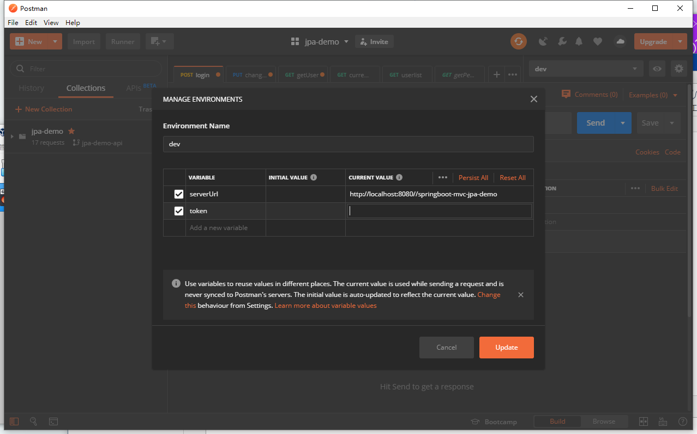

## springboot-jpa 基于token 登录的后台

使用shiro做权限管理 并设计好权限模块功能\
通过持久化session 并返回sessionId 作为token\
前端需要把token放在header中带过来

需要额外安装**redis mysql fastDfs**\
推荐安装在**linux**上\
fastDfs只能在linux上,哪怕是win上的docker运行也有问题 win和mac因为不支持 --network=host
如果没有linux服务器 可以用虚拟机弄个linux 然后在上面部署一个docker 安装fastdfs
sql结构文件是***springboot-mvc-jpa.sql***

相关测试接口 postman 分享地址 https://www.getpostman.com/collections/e67dcdbc28ed45423964  
请使用postman的 Import功能导入接口
**请配置postman变量 token 和serverUrl,token是访问login方法后返回的token**

